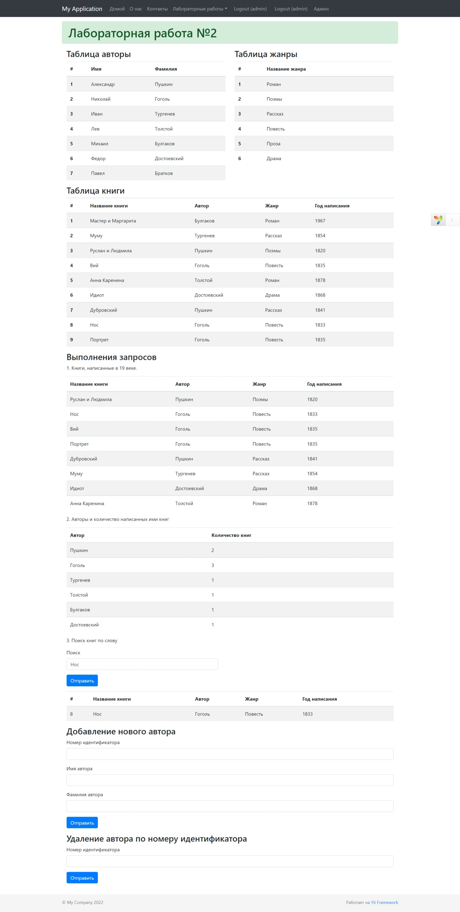
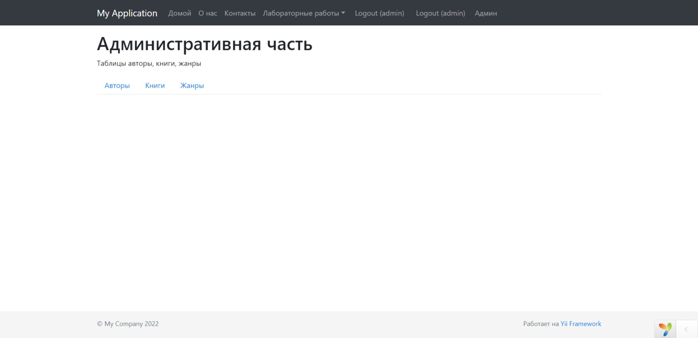
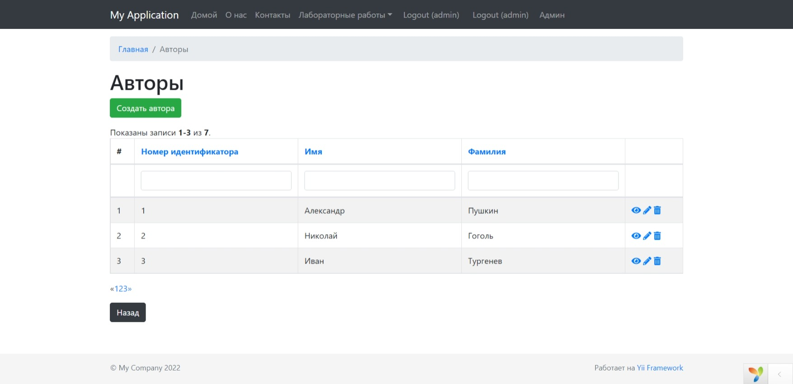
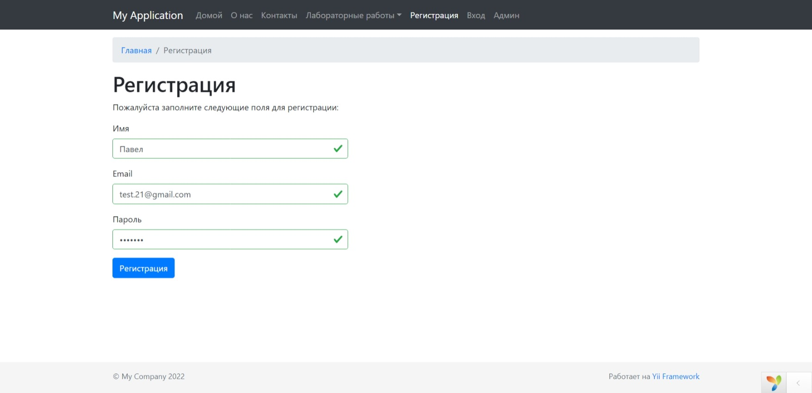

# Yii2

### Задание 1

Разработал форму, содержающую отзыв о ресторане.

Необходимые поля:

- Имя
- Электронная почта
- Дата посещения
- Возраст
- Любимая кухня
- Порекомендуете друзьям?
- Текст отзыва

Правила валидации:

- Имя длиной от 5 до 30 символов
- Корректный адрес электронной почты
- Корректный формат даты посещения
- Возраст от 18 до 100
- Комментарий не содержит лишних пробелов
- Все поля обязательны для заполнения
- Свое сообщение об ошибке

Переданный отзыв вывел на экран в виде таблицы

### Задание 2

Создал базу данных yii2 и таблицы авторы, книги и жанры в phpmyadmin. (db.sql находится в папке sql)

Реализовал вывод содержимого всех таблиц.

Выполнил следующие запросы:

- Найти книги, написанные в 20 веке. Отсортировать по году написания.
- Вывести авторов и количество написанных ими книг.
- Найти книги, в названии которых содержится слово. Слово вводить в форму.

Создал форму для добавление нового автора.

Создал форму для удаления автора из таблицы.

### Задание 3

Создал CRUD-приложение для работы со всеми таблицами базы данных(авторы,жанры,книги).

Реализовал регистрацию и доступ к таблицам только авторизованным пользователям.

