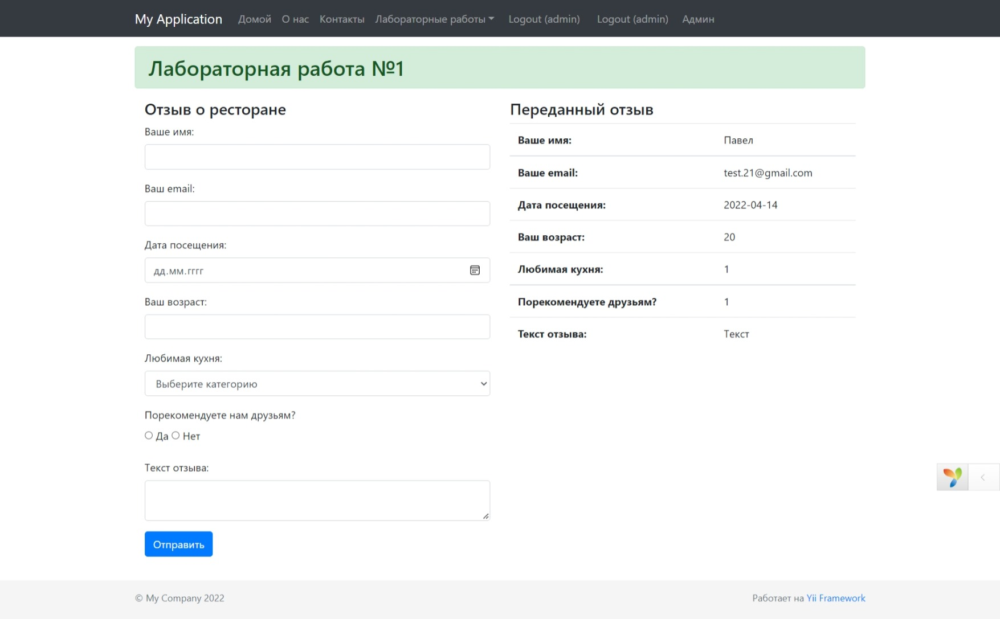

# Yii2

### Задание 1

Разработал форму, содержающую отзыв о ресторане.

Необходимые поля:

- Имя
- Электронная почта
- Дата посещения
- Возраст
- Любимая кухня
- Порекомендуете друзьям?
- Текст отзыва

Правила валидации:

- Имя длиной от 5 до 30 символов
- Корректный адрес электронной почты
- Корректный формат даты посещения
- Возраст от 18 до 100
- Комментарий не содержит лишних пробелов
- Все поля обязательны для заполнения
- Свое сообщение об ошибке

Переданный отзыв вывел на экран в виде таблицы

### Задание 2

Создал базу данных yii2 и таблицы авторы, книги и жанры в phpmyadmin.

## DIRECTORY STRUCTURE

      assets/             contains assets definition
      commands/           contains console commands (controllers)
      config/             contains application configurations
      controllers/        contains Web controller classes
      mail/               contains view files for e-mails
      models/             contains model classes
      runtime/            contains files generated during runtime
      tests/              contains various tests for the basic application
      vendor/             contains dependent 3rd-party packages
      views/              contains view files for the Web application
      web/                contains the entry script and Web resources
